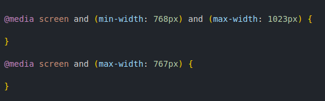
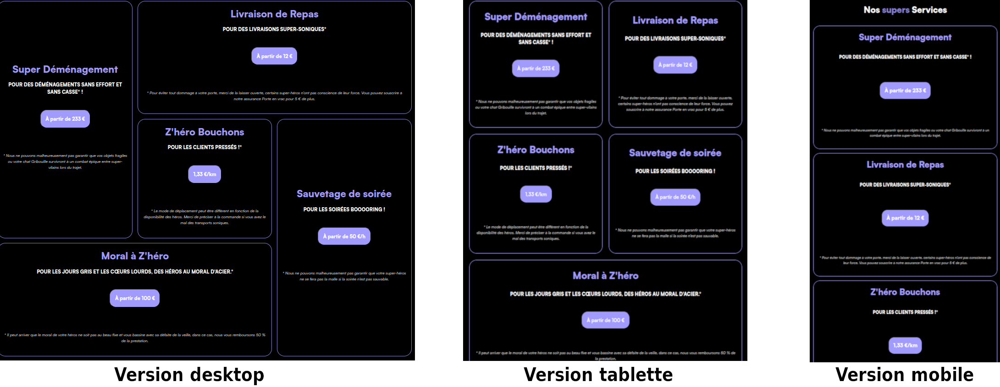

# Heros League

Heros league est un projet réalisé durant ma formation à l'école O'Clock. Cet exercice a pour but de pratiquer le HTML et le CSS vanilla.

##  HTML 5

### Appel à une police tiers

Pour donner un peu de personnalité au site, l'utilisation d'une police externe était requise. J'ai choisi la police Satoshi, disponible depuis le site [fontshare](https://www.fontshare.com).

### Choix des balises pertinentes pour rendre la structure claire et accessible

Une structure pertinente et claire offre plusieurs avantages parmi lequels :

- Un meilleur référencement du site web,
- Facilite l'accessibilité du site y compris pour les personnes en situation de handicap ayant recours à un lecteur d'écran.

### Configuration d'un formulaire

L'utilisation d'un formulaire avec ces labels, input, select, etc est un incontournable dans le web moderne.

##  CSS 3

### Utilisation d'un reset CSS

Cela m'a permis de m'affranchir des configurations implicites des navigateurs et ainsi de pouvoir gérer au mieux mon rendu.

### Gestion du menu

Le menu doit apparaître dans le format desktop et tablette par-dessus le contenu de la page. Ici, l'utilisation de la position: sticky et d'un top de quelques pixels permet d'atteindre l'objectif.

### Configurer les hover

#### Hover simple

Ici c'est un hover sur le bouton qui entraine le changement de la tête de la couleur de fond.

#### Hover complexe

Dans cet exercice, l'objectif est de faire apparaître un texte supplémentaire sur la vignette des héros. Ce texte apparaît par le haut de l'image.

### Responsive

#### Utilisation de media queries (mobile, tablette et desktop)

Afin de rendre le site lisible sur les différents appareils, 3 media queries ont été utilisés pour convenir aux différents formats d'écrans : une pour les écrans de moins de 767px (orienté mobile), une pour les écrans de 768 à 1023px (orienté tablette) et la dernière pour le format desktop.

#### Utilisation de grid et flexbox

La flexbox a été utile pour la mise en forme des menus et l'organisation en colonne sur le format mobile.
L'utilisation de la grid a permis une mise en page originale pour la section services au format desktop, et adaptative au format d'écran en cours pour garder une qualité de lecture au plus juste.
